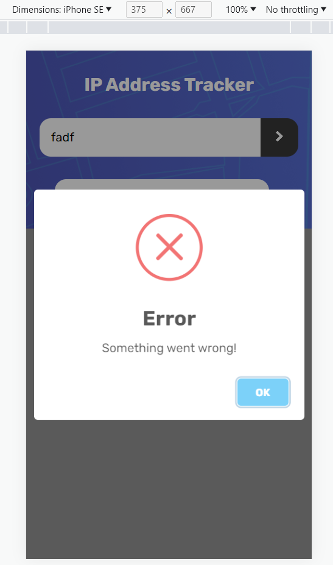

# Frontend Mentor - IP address tracker solution

This is a solution to the [IP address tracker challenge on Frontend Mentor](https://www.frontendmentor.io/challenges/ip-address-tracker-I8-0yYAH0). Frontend Mentor challenges help you improve your coding skills by building realistic projects. 

## Table of contents

- [Overview](#overview)
  - [The challenge](#the-challenge)
  - [Screenshot](#screenshot)
  - [Links](#links)
- [My process](#my-process)
  - [Built with](#built-with)
  - [What I learned](#what-i-learned)
  - [Continued development](#continued-development)
  - [Useful resources](#useful-resources)
- [Author](#author)
- [Acknowledgments](#acknowledgments)

**Note: Delete this note and update the table of contents based on what sections you keep.**

## Overview

### The challenge

Users should be able to:

- View the optimal layout for each page depending on their device's screen size
- See hover states for all interactive elements on the page
- See their own IP address on the map on the initial page load
- Search for any IP addresses or domains and see the key information and location

### Screenshot

### Links

- Solution URL: [Github](https://github.com/JosephMen/ip-address-tracker.git)
- Live Site URL: [Deploy site](https://ip-tracker-frander.netlify.app/)

## My process

### Built with

- Semantic HTML5 markup
- CSS custom properties
- Flexbox
- CSS Grid
- Mobile-first workflow
- Sweet Alert

### What I learned

I have learned how to better use absolute and relative positions to overlap elements, also something about maps.

### Continued development

The creation of modern web sites with modern components is quite a broad topic. Styles and color accents is an area that I would like to spend less time thinking about and have a solid foundation for a streamlined design.

### Useful resources

- [LeafletJS](https://leafletjs.com/examples/quick-start/) - This helped me to create a map in a simple way and use the latitude and longitude data to position the map.
- [Geo Ipify](https://geo.ipify.org/docs) -The ips search engine was very useful and the interface and documentation was very easy to understand.
- [Sweet Alert](https://sweetalert.js.org/) For the creation of error alerts in a simple and beautiful way

## Author

- Website - [My CV Website](https://frander-cv.netlify.app/)
- LinkedIn - [Joseph Mena](https://www.linkedin.com/in/josephmena97/)

## Acknowledgments

when you are creating a page and you notice that sometimes some divs, inputs and components are a little bit separated even when you already put margin:0 and padding:0 this is because the browser always leaves those spaces depending on the font size, to fix this in an easy way, put font-size: 0 to the parent and define the font-size inside the children if you need them, just consider if you are using rems.

